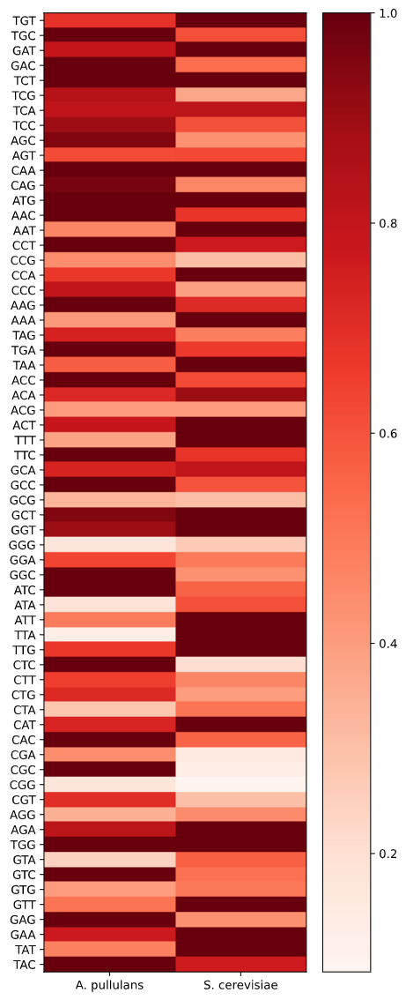

codonOptimizer.py
===============

Introduction
------------

codonOptimizer.py is a module with functions to calculate relative synonymous codon usage (RSCU) values, 
and to use RSCU values to create codon optimized versions of provided gene or coding sequences. 

Example use cases are provided as jupyter notebooks.

Requirements
------------

codonOptimizer.py relies on Biopython.
Installation requires setuptools.
The example below requires numpy, pandas, and matplotlib.

Installation
------------

Install using pip:
`pip install -i https://test.pypi.org/simple/ codonOptimizer==0.1.0`

Or clone this repo and import the module manually

Example
-------

Comparing codon usage patterns in *Saccharomyces cerevisiae* and *Aureobassidium pullulans*

```
import codonOptimizer as co

co.clean_CDS("README_files/ScCDS.fna", output_file="README_files/ApCDS.fna")
co.get_pref_codons("README_files/ApCDS.fna", output_file="README_files/Ap_pref_codons.fasta")

co.get_pref_codons("README_files/ScCDS.fna", output_file="README_files/Sc_pref_codons.fasta")

import pandas as pd

Ap_pref = pd.read_csv("README_files/Ap_pref_codons.fasta", names=["Codon", "CAI"], header=None)
Sc_pref = pd.read_csv("README_files/Sc_pref_codons.fasta", names=["Codon", "CAI"], header=None)

import matplotlib.pyplot as plt
import numpy as np

fig, ax = plt.subplots(figsize=(5, 15))
im = ax.imshow(np.vstack((Ap_pref["CAI"],Sc_pref["CAI"])).T,cmap="Reds")
fig.colorbar(im)
ax.set_yticks(np.arange(len(Ap_pref["Codon"])))
ax.set_xticks(np.arange(2))
ax.set_yticklabels(labels=Ap_pref["Codon"])
ax.set_xticklabels(labels=("A. pullulans", "S. cerevisiae"))
ax.set_aspect('auto')
```


Codon optimizing green fluorescent protein for expression in *Aureobassidium pullulans*
```
import codonOptimizer as co

co.clean_CDS("README_files/CDS.fna", output_file="README_files/ApCDS.fna")
pref_codon_dict = co.get_pref_codons("README_files/ApCDS.fna")

co.codon_optimize("README_files/GFP.fa", pref_codon_dict, output_file="README_files/ApOpt_GFP.fa")
```
